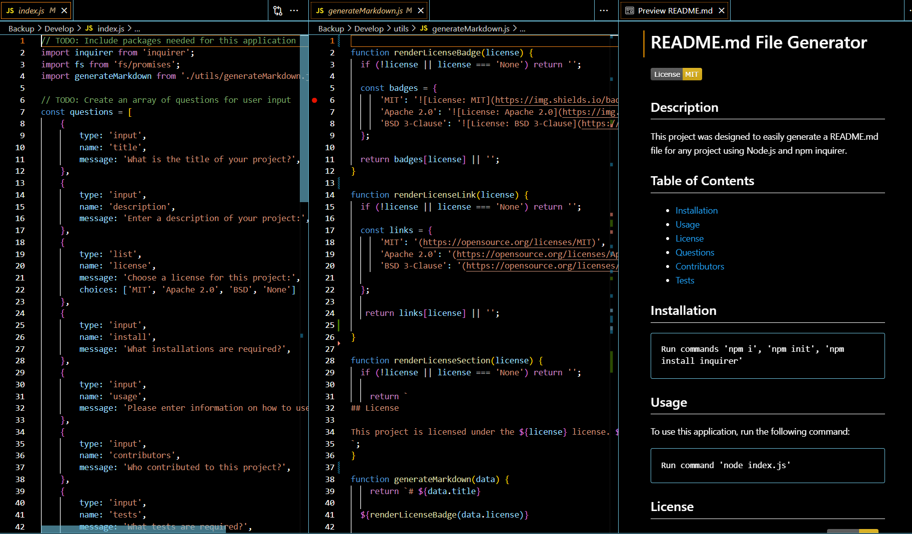

# Research

  

## Description

This is a reusable application designed to easily create README.md files for any application

## Rendered README.md

## Table of Contents

- [Installation](#installation)
- [Usage](#usage)
- [License](#license)
- [Questions](#questions)
- [Contributors](#contributors)
- [Tests](#tests)

## Installation
 
From integrated terminal root directory 'Develop' run these commands:  `npm i`   `npm init`  `npm install inquirer`
 
 
## Usage
From integrated terminal root directory 'Develop' run this command: `node index.js`
 
## License

## Contributors
 
Nancy Watreas, Claude ai
 

## Tests
 
run `node index.js`
 
 
## Questions
For questions about this project, please contact me at: 
[Github](https://github.com/noIDEA-tech),
[nwatreas2023@gmail.com](mailto:nwatreas2023@gmail.com)
 
 
