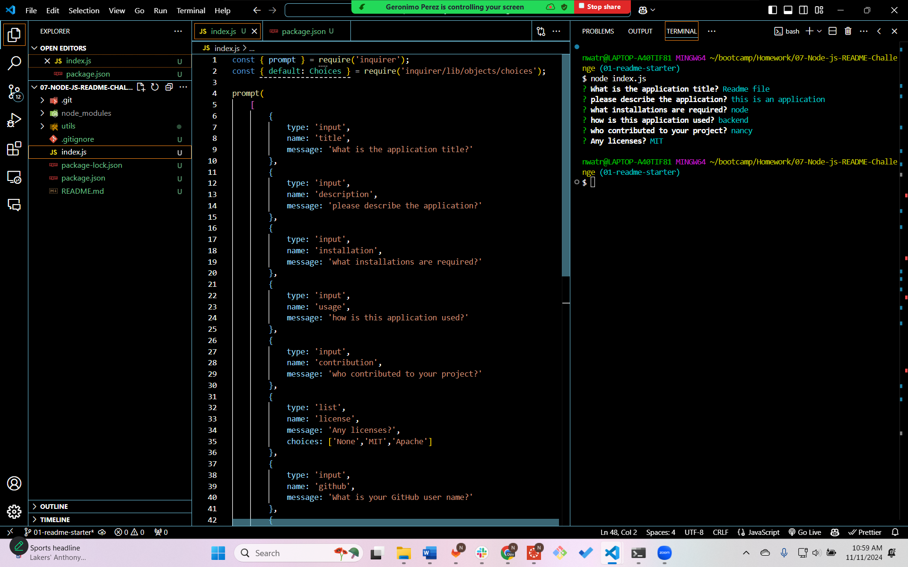

# Readme file

## Description
application

## Table of Contents
- [Installation](#installation)
- [Usage](#usage)
- [Credits](#credits)
- [License](#license)
- [Features](#features)

- [Contact](#contact)

## Installation
node, javascript, ,inquirer

## Usage
run the index.js file

## Credits
nancy

## License
MIT

## Features
provided a professional readme file

## Contact
If there are any questions or concerns, I can be reached at:
##### [github: noIDEA-tech](https://github.com/noIDEA-tech)
##### [email: nwatreas2023@gmail.com](mailto:nwatreas2023@gmail.com)
